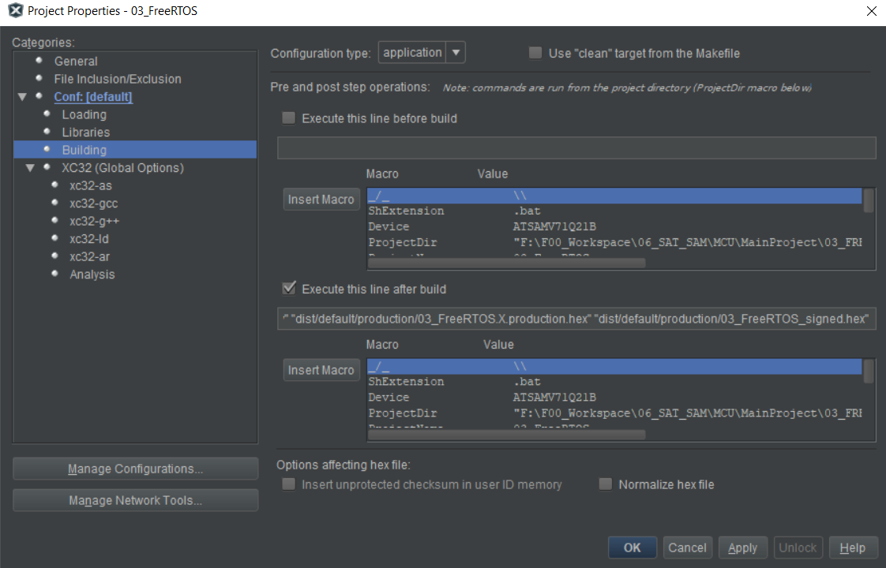

# SAM-EXP MCU Source
This is code for SAM-EXP-MCU/ATSAMV71-based boards

## Bootloader
#### Step 1: Run post-command to sign firmware HEX image

> **Example**:
```bash
python "../tools/xbld_sign.py" "${ImagePath}" "${ImageDir}/${ProjectName}_signed.hex"
```
#### Step 2: Add extra loadable projects
(Bootloader and Application will be flashed at the same time)

#### Step 3: Flash application using MPLAB
- Bootloader will run first
- Timeout: 60 seconds remaining for flashing via tool
- Press any key to reset

**If NOT using the flashing tool, press J twice (J + J) to force jump to the application**
  
